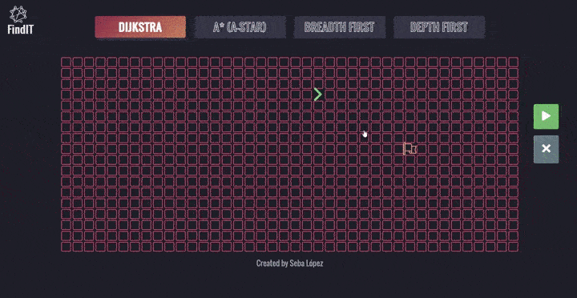

## 2D Pathfinding Visualizer

Live demo: https://sebalg.github.io/2D-Pathfinding-Visualizer/

 

 > - Only Dijkstra available at present

## Stack

|                  React Hooks                  |              Style Preprocessor              | 
| :-------------------------------------------: | :------------------------------------------: |
|  |  |

## Available Script (create-react-app)

In the project directory, you can run:

### `yarn start`

Runs the app in the development mode. 
Open [http://localhost:3000](http://localhost:3000) to view it in the browser.

The page will reload if you make edits. 
You will also see any lint errors in the console.

### `yarn build`

Builds the app for production to the `build` folder. 
It correctly bundles React in production mode and optimizes the build for the best performance.

The build is minified and the filenames include the hashes. 
Your app is ready to be deployed!

See the section about [deployment](https://facebook.github.io/create-react-app/docs/deployment) for more information.

## Learn More

You can learn more in the [Create React App documentation](https://facebook.github.io/create-react-app/docs/getting-started).

Only Dijkstra available at present
